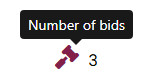
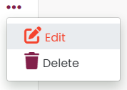

# Artly


(By Laura Kondrataite)

Are you looking for a place where to sell your art? Or perhaps you wish to purchase a piece of artwork from a local/independent artists? Then look no further!

**Artly** is a product comparison site which promotes sharing most beloved artworks with like minded people. Whether you are looking to sell or buy a unique pieces of art, Artly promotes a is led by arts community who wishes to share and sell their artwork.

**Please note:** This repository covers the front-end Artly project development.which was created as part of a web development course with Code Institute. To see the back-end repository for this project click [here](https://github.com/laurakond/artly-api), and the deployed API [here](https://artly-api-a39d790259f4.herokuapp.com/).

Live **Artly** site can be found [here](https://artly-a211b809ae81.herokuapp.com/).

## Table of Contents

[Design](#design)

- [Target Audience](#target-audience)
- [User Stories](#user-stories)
- [Flowcharts](#flowcharts)
- [Wireframes](#wireframes)
- [Color palette](#color-palette)
- [Font styles](#font-styles)
- [Architecture solutions](#architecture-solutions)

[Agile Methodology](#agile-methodology)

- [GitHub Project Management](#github-project-management)
- [Epics](#epics)
- [Front-end milestones](#front-end-milestones)

[Features](#features)

- [Existing Features](#existing-features)
- [Reusable Components](#reusable-components)
- [Features Left to Implement](#features-left-to-implement)

[Technologies used](#technologies-used)

- [Languages](#languages)
- [Frameworks and Libraries](#frameworks-and-libraries)
- [Databases](#databases)
- [Other Tools, technologies, packages](#other-tools-technologies-packages)

[Testing](#testing)

[Deployment](#deployment)

- [Github](#github)
  - [How to Fork](#how-to-fork)
  - [How to Clone](#how-to-clone)
- [Heroku](#heroku)

[Credits](#credits)

- [Content](#content)
- [Used code](#used-code)
- [General resources](#general-resources)
- [Acknowledgments](#acknowledgments)
- [Code inspiration](#code-inspiration)

[Return to Table of Contents](#table-of-contents)

## Design

### Target Audience

The primary target audience for the website is:

- persons of any gender aged 16+ who enjoy art,
- artists who wishes to share their work,
- art connoiseurs who are looking for alternative ways in selling owned artwork.

No background, geographical location or income has been specified for the target audience.

### User Stories

|                                                    | As a Developer                                                                                                                                                |
| -------------------------------------------------- | ------------------------------------------------------------------------------------------------------------------------------------------------------------- |
| [1](https://github.com/laurakond/artly/issues/1)   | As a developer I can set up a new workspace for front-end so that I can start working on my project.                                                          |
| [2](https://github.com/laurakond/artly/issues/2)   | As a developer I can deploy the front-end repository to Heroku so that it is accessible online.                                                               |
| [3](https://github.com/laurakond/artly/issues/3)   | As a developer I can add a favicon so that the website renders appropriate image in the browser.                                                              |
| [4](https://github.com/laurakond/artly/issues/4)   | As a developer I can add main website keywords and description so that the website gains higher searchability in the search engines.                          |
| [5](https://github.com/laurakond/artly/issues/5)   | As a developer I can apply design of choice so that the website is visually appealing and represents the purpose.                                             |
| [6](https://github.com/laurakond/artly/issues/6)   | As a developer, I can carry out website design improvement so that I know the project adheres to the principles of UX/UI design.                              |
| [7](https://github.com/laurakond/artly/issues/7)   | As a developer, I can note the website progression in the front-end README so that anyone can see the steps and actions taken for the release of the website. |
| [8](https://github.com/laurakond/artly/issues/8)   | As a developer, I can fix the bugs for the front-end so that I can ensure any issues are handled before the initial project release.                          |
| [9](https://github.com/laurakond/artly/issues/9)   | As a developer, I can carry out user stories testing so that I know all main user criteria and MVP are met.                                                   |
| [10](https://github.com/laurakond/artly/issues/10) | As a developer, I can perform manual tests for front-end so that I know all functionalities of the website are working.                                       |
| [11](https://github.com/laurakond/artly/issues/11) | As a developer, I can validate each page and app for front-end so that I know that the code adheres to best practices.                                        |

<br>

|                                                    | As a First time user                                                                             |
| -------------------------------------------------- | ------------------------------------------------------------------------------------------------ |
| [12](https://github.com/laurakond/artly/issues/12) | As a first time user I can create an account so that I can sign in and access member's features. |

<br>

|                                                    | As a site user                                                                                                                           |
| -------------------------------------------------- | ---------------------------------------------------------------------------------------------------------------------------------------- |
| [13](https://github.com/laurakond/artly/issues/13) | As a site user I can login to & logout of the website so that I can access functionality for logged in users.                            |
| [14](https://github.com/laurakond/artly/issues/14) | As a site user I can view the navbar from every page so that I can navigate easily between pages.                                        |
| [15](https://github.com/laurakond/artly/issues/15) | As a site user I can see a list of posted artworks on the home page so that I can clearly see the latest posts that have been published. |
| [16](https://github.com/laurakond/artly/issues/16) | As a logged in user I can create my own artwork post so that I can share it with others and sell it.                                     |
| [17](https://github.com/laurakond/artly/issues/17) | As a site user I can edit the artwork post so that I can show the most up to date information.                                           |
| [18](https://github.com/laurakond/artly/issues/18) | As a site user I can delete the artwork post so that it is no longer visible on the website for others to see.                           |
| [19](https://github.com/laurakond/artly/issues/19) | As a site user I can access a detailed artwork post so that I can read more about it.                                                    |
| [20](https://github.com/laurakond/artly/issues/20) | As a buyer I can make a bid the artwork so that I can buy it.                                                                            |
| [21](https://github.com/laurakond/artly/issues/21) | As a buyer I can delete my bid so that I can control removal of my bid for the artwork’s post.                                           |
| [22](https://github.com/laurakond/artly/issues/22) | As a seller I can review pending bids so that I can decide which seller to sell the artwork to.                                          |
| [23](https://github.com/laurakond/artly/issues/23) | As a seller I can set the artwork page as sold so that it is clear to the buyers the artwork is sold.                                    |
| [24](https://github.com/laurakond/artly/issues/24) | As a seller I can get in touch with the buyer to organise the collection of the artwork.                                                 |
| [25](https://github.com/laurakond/artly/issues/25) | As a logged in user I can update my profile so that I can keep it up-to-date with most relevant information.                             |
| [26](https://github.com/laurakond/artly/issues/26) | As a logged in user I can save the artwork post so that I can access them in one place.                                                  |
| [27](https://github.com/laurakond/artly/issues/27) | As a site user I can search for artworks by keyword or filter by category/style so that I can find listings relevant to my interests.    |
| [28](https://github.com/laurakond/artly/issues/28) | As a site user, I can see notification messages so that I know that my action was successful/completed.                                  |
| [29](https://github.com/laurakond/artly/issues/29) | As a site user I can see most popular artwork posts displayed on each page so that I can view their profiles.                            |
| [30](https://github.com/laurakond/artly/issues/30) | As a site user I can submit a contact form to site admins so that I can report any issues with the website.                              |
| [31](https://github.com/laurakond/artly/issues/31) | As a developer, I can perform automated tests for front-end so that I know all functionalities of the website are working.               |

<br>

### Wireframes

The following wireframe report show the initial idea of how the website would look on different devices: mobiles, tablets/iPads and laptops/desktops.

- [Full Wireframe report](documentation/docs/artly-wireframes.pdf)

### Color palette

The following palette was used to ensure the contrast is achieved between the main parts of the website:

- #82204a - Murrey - for emphasising clickable words, i.e. Sign up, and font awesome icons, buttons
- #82204a4a - a variation of the above for the top sellers scroll bar color
- #f4442e - Cinnabar - for the active class, logo splash, sold ribbon, hover effects
- #f4452ecb - variation of the above for the button border color
- #273c2c - Dark green - for the image container background
- rgba(39, 60, 44, 0.25) - Dark green color in rgba for the box shadow effect
- #090c02 - Smokey black - for the main font color
- #F9F8F8 - Seasalt - for the main background and light font color
- #E7C69E - Sunset - for the upload image frame
- #FFFFFF - default card background color resused for the form backgrounds

  - rgba(255, 255, 255, 0.8) - rgba equivalent of the above white for the button colors (came with the style)

- #ced4da - French grey - default border color

  
  

<br>

### Font styles

I used [Google fonts](https://fonts.google.com/) to source the fonts for the website. These are:

- Gothic - was used for the website logo.


- Montserrat, serif - was used as the main text font.
- Poppins, system-ui - was used for the accent text such as form labels.


### Architecture solutions

- The website was designed using React framework which allows seamless navigation and trasition between pages without having to refresh/reload the website through the use of components.
- The current file structure will be reviewed and improved at the next development stage in order to adhere to React architecture best practices. This includes:
  - restructuring files/folders within src directory
    - moving files to the right place
  - extracting functionality of some features into independent reusable components and placing them appropriately within the file structure

[Return to Table of Contents](#table-of-contents)

## Agile Methodology

### GitHub Project Management


The project was completed using Agile methodology. I have used one Project board for both the API and Front-end repositories in order to keep track of the progress, sometimes revising estimated dates and tasks that were needed to be done by a certain point.

The link to the project board can be found [here](https://github.com/users/laurakond/projects/14).

- I chose the "trafic-light" color scheme for the MoSCoW method in order to indicate which tasks were a priority (green must-haves) and which ones were not(red won't-haves) for my project board.
  - This provided clarity and better understanding for myself as I was a sole project contributor.

I used the same Milestones, Epics and labels within the API and Front-end repositories to help organise front-end and back-end user stories. This allowed me to keep track of the progress and ensure that the project MVP was completed in time.

MoSCoW methodology was used to map out which features were required for the MVP, and only address the others if there was sufficient time left.


### Epics

The below list displays all the epics used throughout the project development, including the Artly api backend and frontend.

- **Epic 1:** Project setup - this stage was important to kick start my work on the project, ensuring that initial workspaces were created and appropriate dependencies installed.
- **Epic 2:** Deployment - I set out to deploy the API as soon as possible in order to test any issues that might arise.
- **Epic 3:** User authentication - this part of the project was essential for enabling user-specific authorised access.
- **Epic4:** User registration - this part ensured that the user can create an account and login on the front-end.
- **Epic 5:** User navigation - this allowed the user to navigate the website seamlessly upon login/logout.
- **Epic 6:** Artwork functionality - this feature allows the user to create an artwork listing for sale. It has the main MVP CRUD functionality.
- **Epic 7**: Offer functionality - this feature provided an ability to leave the bid and accept/reject the bid.
- **Epic 8:** Profile functionality (optional) - this feature allows the user to manage their profile.
- **Epic 9:** Save functionality (optional) - this feature allows the user to save their favoured artwork listings.
- **Epic 10:** Contact functionality (optional) - this feature allows the user to report any website errors to the site administration.
- **Epic 11:** Testing and bug fixes - this part of the project was crucial to ensure that the project was working seamlessly and had minor/none bugs.
- **Epic 12:** Documentation - documentation was a crutial part of the project work which allowed me to document the progress and resources used for the develpment of the work.
- **Epic 13**: User nofications - this provided users with notification messages upon various interactivity.
- **Epic 14**: Website design - this part allowed me to assess and improve any design choices/decisions for the front-end of the project as I progressed.
- **Epic 15**: Follower functionality (optional) - this feature allows the user to follow and unfollow chosen users' profiles.

### Front-end Milestones

- The noted milestones are for the front-end project development only. To see the milestones for the back-end, follow the link [here](https://github.com/laurakond/artly-api?tab=readme-ov-file#back-end-milestones).

- **Milestone 1:** Project board
  - Set up a project board.
- **Milestone 5:** Navigation
  - Display the navbar from every page.
- **Milestone 6**: Registration
  - Create an account
  - Log in and log out
- **Milestone11:** Front-end initial set up
  - Set up a new workspace for frontend.
  - Add favicon and boilerplate.
- **Milestone12**: Front-end Artwork CRUD functionality
  - View artwork listings on the homepage.
  - Access detailed artwork posts.
  - Create, edit, delete artwork posts.
- **Milestone13:** Front-end Offer CRUD functionality
  - Make offers for artwork.
  - Review pending offers.
- **Milestone14:** Front-end Profile CRUD functionality(optional)
  - View user profile
  - Edit user profile
  - Delete user profile
- **Milestone15:** Front-end Save CRUD functionality(optional)
  - Save a post for future reference
  - Remove saved post
  - View saved posts in Saved component
- **Milestone16:** Front-end Contact CRUD functionality(optional)
  - Submit contact form to admin
- **Milestone17:** Testing & bug fixes
  - Perform automated and manual tests for front-end.
  - Fix front-end bugs.
- **Milestone18:** Front-end Readme & Testing files
  - Validate each front-end page and app.
  - Document the progress in the README and TESTING files
- **Milestone19:** User feedback
  - Receive notifications upon completed task
- **Milestone20**: Website design
  - Improve website UX/UI

[Return to Table of Contents](#table-of-contents)

## Features

### Existing Features

Majority of the website content is available to any user regardless of their registration status. Restricted features are the ones that allow the user to interact with the website beyond content browsing.

**Logo and favicon**


- Upon loading the website, the user is greeted by a creative Logo to the left of the Navigation bar, which indicates the website's creative flare.
- Similarly, the favicon clearly makes the website standout amongst many opened browser tabs clearly indicating which tab belongs to the Artly website.

**The Header**

- Featured across all the pages, the Header is fully responsive and presents the user with the main pages that are required. To the left of the header you find:

  - The Logo

- To the right of the header the remainder of the pages:

  - Home Page
  - Sign In
  - Sign Up

- The user can clearly see the navigation between different buttons with the hover effect, and one the button is clicked, the change of color of the button indicates the section/page that the user is at.
  

  **Mobile**

  

  

  **Desktop**

  

- Upon Registration or Log in, the user's profile avatar and additional four pages and a Sign out are revealed in the header. This creates a sense of personalisation and indicates additional website functionality for the registered users.

  - List Art Page
  - Saved Page
  - Followed Page
  - Profile Avatar
  - Sign out

  **Mobile**

  

  **Desktop**
  

**The Landing Page**

- The Landing page of the website is designed to clearly indicate the purpose upon first visit. The user can straight away see all the artworks that have been listed for sale.
  - The page acts as the main content container incorporating multiple features (components) that are discussed further along in full detail.
- Each artwork listing provides the most essential information, and can be clicked to access more information about the artwork.
- Infinite scrolling has been implemented to ensure that the list is refreshed and loads more artworks as the user scrolls down the list.
- The user can see a list of top selling profiles, and search/filter functionality that allows them to search and filter the list view based on the following criteria:

  - Search bar for artworks, artist name, username
  - Filter by Artwork style
  - Filter by Artwork type
  - Filter by Artwork's sold status:

    - the sold artworks are marked with a Sold label that clearly indicates their unavailability for purchase

  <details>
    <summary>Mobile artwork list screenshow</summary>
      
    

  </details>

  <details>
    <summary>Desktop artwork list screenshow</summary>
      
    

  </details>

**Create Artwork form(restricted access)**

- Upon registration or logging in, the user can create an artwork by clicking on the "List Art" in the navigation bar.
- The user will be taken to a form where they can choose to upload an image, and enter information about the artwork.
  - If the user enters incorrect information or leaves a required field empty, an error message will appear indicating so upon submission.
    - required fields have been marked with an asterisk `*` and an explanation at the bottom has been included for better user experience
  - If the user uploads an image that exceeds the limit, an error message will appear indicating so.
- Once the artwork form is submitted, the user will see a confirmation message on the top right corner.

  - If the user clicks on the cancel button, they will be taken back to the previous page.

    - Mobile

      

    - Desktop

    

  

**Artwork detail view page**

- Upon clicking on the individual artwork card, the user is taken to a detailed artwork page that displays full information about it, including the style, type, contact details of the seller and the location of the artwork.
- Below the artwork information, the user can see the Existing Bids feature (discussed below) which displays any bids submitted for the artwork. If the user wishes to interact with this feature, they are required to Sign in or Sign up.

  

**Artwork detail view(restricted access)**

- Once logged in, the user can choose to edit or delete their artwork listing by clicking on a three dots favicon (pictured below).

  - If the user chooses to edit the artwork, they are taken to the artwork edit form.
  - If the user chooses to delete the artwork, they will be notified by a pop up notification if the action was successful or not.

  

**Artwork edit form(restricted access)**

- If the user chooses to edit the form in the detailed artwork view, they are taken to the artwork edit form, which is the same as Artwork create form.
  - The user will be able to see preexisting information populated in the fields, and amend them accordingly.
- Similarly to the Artwork create form, the user can either submit or cancel the form.

  - Upon successful update, the user will see a notification message appear and they will be taken to the artwork detail view where they can review the information.

  

**Artwork bid feature - buyer (restricted access)**

- When inside the detailed artwork view, the user can choose to bid(buy) on an artwork if the artwork is not their own.

  - A bid form is visible underneath the detailed artwork view where the user needs to enter the bid price and their contact details.

    - The bid form is visible to registered buyers only, i.e. not the owners of the artwork.
    - The form validates incorrect data input including negative or 0 value price offers.
      - an error message will appear accordingly.
    - Upon bid submission the user will be notified if the action was successful or not.
    - The user's bid price and bid status will appear below the bid form, also showing when the bid was created. This allows for the users to track the progress and see when the other bids were submitted too.

- If the user wishes to remove their bid, they can delete it.

  - Similarly to the artwork delete functionality, a notification will indicate if the action was completed successfully or if there were any errors.

  

  

  

**Artwork bid feature - seller (restricted access)**

- Once the bid is submitted, the seller (artwork owner) can then access the artwork detail view to update the bid status.

  - There are three options available to choose from:

    1. Approve the bid
    2. Reject the bid
    3. Mark as sold

  - Upon clicking any of these, the buyer's bid status will update for everyone to see.
  - If the Bid is marked as sold:
    - The artwork automatically updates to being sold
    - The "Sold" ribbon appears on the top right corner of the artwork card
    - A call to action button is revealed to the seller to "Contact the buyer"
      - Once clicked, a mailto functionality will be activated in a separate window.
    - The bid form is hidden for everyone clearly indicating that no more bids can be submitted for this artwork.
    - If there are any other bids for the artwork, their bid status is hidden to indicate which of the bid was accepted.
  - Once the artwork is marked as sold, the seller cannot edit the listing.

  

  

  

**Saved artworks(restricted access)**

- The user has an option to save an artwork by clicking on the bookmark icon in the artwork list view.
  - The icon will change to indicate that the user has already saved it.
  - The saved artwork count displayed next to the icon, indicates to how many users have the artwork saved, and will discrease/increase based on the saved artwork count.
- To access and review the saved artworks, the user can do so by clicking on the "Saved artworks" button in the navigation bar.
- The list of artworks is rendered the same way as the main artwork list.

  

  

**Profile view**

- Any user can view their own and another user's profile, where they can see various information about that user, including:

  - The user's avatar,
  - the location,
  - portfolio url,
  - number of artworks,
  - number of sold artworks,
  - followed and following users count

- These are all displayed within the main area of the profile view.

- Other information relating to the artist user is displayed using React bootstrap's Tabs component, splitting the information into two tabs:

  - More details - styles, techniques, collaborations, influences
  - Artworks - a list of the user's artworks

- The current profile feature is set up focusing on a user who is an artist in mind.

  - The section "More details" allows these users to include relevant information about their work.
  - Further developments, including separation of the seller and buyer profiles is noted in the [Features left to implement](#features-left-to-implement) section.

  

  

**Profile view(restricted access)**

- Similarly to the artwork feature, the users can edit their profiles by choosing one of the following options from the edit drop down list:
  - edit profile - redirects to the profile edit form page
  - change username - redirects to the username edit form page
  - change password - redirects to the password edit form page


**Edit Profile form(restricted access)**

- If the user chooses to edit the profile, they are taken to the profile edit form.
  - The user will be able to see pre-existing information populated in the fields, and amend them accordingly.
- Similarly to the Artwork create/edit forms, the user can either submit or cancel the form.

  - Upon successful update, the user will see a notification message appear and they will be taken back to the profle view.
  - If the user chooses to cancel the edit, they will be taken back to the profile view as well.
  - All form fields are optional.

  

**Change username form(restricted access)**

- Similarly to the profile edit form, upon selecting edit username, the user is taken to the username edit form where they can either update or cancel the action.

  - In both instances, the user will be taken back to the profile view.

  

**Change password form(restricted access)**

- Similarly to the profile edit form, upon selecting edit username, the user is taken to the username edit form where they can either update or cancel the action.

  - In both instances, the user will be taken back to the profile view.

  

**Followed users(restricted access)**

- Similarly to the Saved artworks feature, the user can (un)follow other users by clicking on the (un)follow button within the user's profile, or "plus"/"minus" icons within the top sellers feature.
- The followed user's content can be found within the "Followed profiles" button in the navigation bar.

  - The current set up is displaying followed users' artworks.

  
  

**Top sellers feature**

- The Top sellers feature is displayed throughout the website for easy access so that the users could view the profiles that have sold the most artworks.
  - The current functionality of this feature lists all users in a descending order from the most sold to the least sold.
    - It was a design choice to have the users displayed as such due to limited number of users at the time of MVP release.
  - Further development of this feature is noted in the [Features left to implement](#features-left-to-implement) section.
- A scrollbar has been implemented to allow horizontal display of the feature.

  - On desktop, it is only visible once the user is signed in, and is controlled by the arrows on each end.
  - On mobile, the users can swipe left and right to flip through the profiles.

  

  

**Search/Filter feature**

- The search and filter feature is implemented throughout the website, which allows the user to look for their preferred artwork at ease.
- Users can use the username, artwork title or artist name keywords to search for appropriate artwork listings.
- To access further filtering, the user can click on the filter icon next to the search bar and choose from the following categories:
  - the type of the artwork
  - the style of the artwork
  - whether the artwork is available for sale
- This feature is available within the main artwork list, saved artworks list, and followed profiles list.

  - Further implementation of the search/filter within the website is noted in the [Features left to implement](#features-left-to-implement) section.
  - If the typed keyword does not match any listing, or there are no artworks within the chosen category, a "No results found" message with an image will be displayed.

  

  

  

  

  

**Tooltip feature**

- Tooltips have been applied throughout the website to provide additional information that indicates user interaction.

  - Where the interaction is available the cursor will also change into pointer and a hover effect is applied to further enhance the user interactivity.
    - **to note:** the screenshots do not display the pointer.

  
  
  

**Default images**

- The artwork and profile features come with a pre-set default image in case the user has not chosen the images upon creating the artwork or profile.

  - This way other features, such as the artwork view and the Avatar view, can function without any issue.

    - These can be updated through the artwork edit and profile edit forms.

      

      

**Page not found**

- The page not found has been added to troubleshoot a url response that does not exist.

  - A link redirecting the user to the main page is included for easy access.

  

**User authentication**

<details>
<summary>Sign Up page</summary>

- Once within the Sign up page, the user is presented with a registration form and an image carousel that displays current artworks.
- The Sign Up form allows the user to create an account in order to access additional features:

  - Artwork create/edit/delete
  - Bid create/edit/delete
  - Save artworks
  - Follow other users
  - Edit Profile, including username and password

- The user is required to enter their username, a password of their choice and confirm the password again.
- Upon successful registration, a confirmation message is displayed at the top of the page and the user is redirected to the Sign in page.
- If the user already has an account, they can click on the Sign in link which will redirect to the Sign in page instead.

- Mobile/tablet

  

- Desktop
  

    </details>

<details>
<summary>Sign In page</summary>

- Once within the Sign up page, the user is presented with a registration form and an image carousel that displays current artworks.
- The Sign in form allows the user to access their account and manage the following features:
  - Artwork create/edit/delete
  - Bid create/edit/delete
  - Save artworks
  - Follow other users
  - Edit Profile, including username and password
- Upon successfull sign in, a confirmation message is displayed at the top of the page and the user is redirected to the home page.
- The user's profile avatar is also visible at the top of the navigation bar and within other features mentioned above.
- If the user does not have an account, they can click on the Sign up link which will redirect to the Sign up page instead.

  - Mobile/tablet

    

  - Desktop
    

  </details>

 <details>
    <summary>Sign Out</summary>

- When the user wishes to leave the account, the Sign out button enables a successful confirmation message and redirects the user to the home page.

  </details>

**Restricted access**

- I have applied defensive programming to several features that are only accessible to the registered. These are:
  - Artwork edit/delete feature
  - Bid edit/delete feature
  - Save artwork feature
  - Profile edit/delete
  - Follow other users feature
- Upon an attempt to access any of these the following will happen:
  - If an unregistered user attempts to access any of the restricted pages by typing in the url link to the browser (i.e. artwork edit form url), they will be taken back to the main page view.
  - I have used React framework to ensure that restricted content/feature is not accessible to unregistered users, thus minimising any errors or access breach.
  - I have used conditional rendering to ensure that certain functionality is not available depending on the state of the feature.

**Notification messages**

<details>
    <summary>User registration/access</summary>


</details>

 <details>
    <summary>Confirmation messages</summary>


</details>

 <details>
  <summary>Error nofitications</summary>


- Other error notification messages that are not pictured but are set up to be raised in case of an error are:

  - Sign out: `"Something went wrong while attempting to sign out. Please try again."`
  - Following a user: `"Something went wrong while attempting to follow <username>."`
  - Unfollow a user: `"Something went wrong while attempting to unfollow <username>."`
  - Delete the artwork: `"Something went wrong while attempting to delete your artwork."`
  - Edit the artwork: `"Something went wrong while attempting to update your artwork."`
  - Accept a bid: `"Something went wrong while attempting to accept the bid."`
  - Reject a bid: `"Something went wrong while attempting to reject the bid."`
  - Mark as sold a bid: `"Something went wrong while attempting to mark the artwork as sold."`
  - Delete a bid: `"Something went wrong while attempting to delete your bid."`
  - Profile edit: `"Something went wrong while attempting to update your profile."`
  - Username edit: `"Something went wrong while attempting to update your username."`
  </details>

<details>
  <summary>Form input validation</summary>


</details>

### Reusable components

- The following reusable components have been set up so that they could re applied through the code avoiding unneccesary code duplication:

**Asset component**

- The asset component is used to display a spinner while the content is loading or no results are found upon search.

  

**Dropdown menu component**

- The dropdown menu component is utilised to allow the users access CRUD functionality throughout the website. It is used for Artwork, Bid and Profile features:

  - Artwork edit/delete

  

  - Bid delete

  

  - Profile edit

  

**Avatar component**

- The Avatar component is implemented throughout the website.
  - It provides a visual aid to the user, easily indicating who the user is, so that specific features such as artworks and bids are clearly marked against each user.
- The Avatar is reused in all major features such as artwork card display, bid display, Top sellers display and profile view display.
  - It is also clickable, which allows the users to access profile view.
- The user can choose to change the image through the profile edit form.

  

  

  

**Image carousel**

- The image carousel feature has been implemented in order to display uploaded artworks to unregistered users in order to showcase them in one place aside from the main page.
  - This feature is used in both the Sign up and Sign in pages noted below.
- The user can use the arrows to flick through the images or stop the carousel upon hovering over the image.

  

### Features Left to Implement

- An in-house messaging functionality, which would allow the sellers and buyers to communicate within one platform.
  - Once the user's artwork receives a bid, or a bid is approved/marked as sold, a notification would be sent to the user's notification board.
  - Any other communication, such as arranging the logistics of the artwork's collection and payment would be sent through the messaging service.
  - Notifications would still be sent to the user's email to make sure that they are notified if any changes are made when they are offline.
- Expand the Profile feature in order to separate the buyers' and sellers' profiles more:
  - The users will be able to select if they are an artist or a artwork owner/art buyer.
    - Based on this, the users will be able to choose from different profile forms to populate
      - Respective profiles would be shown
    - Clear indication through the use of icons/imagery within the website which user is an artist and an art seller or a buyer
  - Create a section for the users to browse all user profiles regardless of their artwork count
- Improve current Top sellers feature to only show the users who have sold artworks
- Implement a contact form so that the users could inform administrators about any errors or bugs in the system.
  - This would be similar to Contact us or Report any errors
- My Bids page would allow the buyers have easy access to the bids they a have placed and see the status of them in one place.
  - At the moment this feature can carried out if the user chooses to save an artwork.
  - This would allow to expand on the existing functionality of the saved artworks feature.
- Expand on and improve artwork edit functionality for the seller allowing the user to remove the sold artworks from the list, which would allow better user experience for the buyers.
  - Create a separate section where the sold artworks would be stored so that any user could access it.
- Restructure and implement a separate search and filter component so that it can be reused throughout the website, for example within the Profile Artwork tab.
- The current form submission is set up to validate form input values upon submission.
  - This will be addressed and changed to on input validation to provide a more seamless user experience when creating a form.

[Return to Table of Contents](#table-of-contents)

## Technologies used

### Languages

- JSX: the primary language used to develop interactive components of the website and handle click events.
- HTML: the markup language used to create the website.
- CSS: the styling language used to style the website.
- Markdown: the markup language to create the README and TESTING files.

### Frameworks and Libraries

- [React](https://react.dev/) framework for overall front-end logic and design.
- [React Bootstrap](https://react-bootstrap-v4.netlify.app/) CSS framework that allowed to implement various styled elements, including modals. It was also used for quick and easy styling of the overall website.

### Databases

- [Artly-api](https://artly-api-a39d790259f4.herokuapp.com/), created as part of the project to store the data.

### Other tools, technologies, packages

- [GitHub](https://github.com/) was used for creating and storing files and folders of the website.
- [Heroku](https://www.heroku.com) was used for accessing and storing my application game.
- **Git** was used for version control.
- **Pip** was used to install required dependencies.
- **Gitpod** editor was used for writing the code.
- **JS Lint**, built in validator, was used to validate JSX code.
- [W3C Markdown](https://validator.w3.org/) was used for validating html files.
- [W3C CSS](https://jigsaw.w3.org/css-validator/) was used for validating css files.
- [Balsamiq](https://balsamiq.com/) used for creating wireframes.
- [Google Fonts](https://fonts.google.com/) for choosing appropriate fonts
- [Favicon](https://favicon.io/) for generating a favicon
- Google Chrome DevTools for testing, troubleshooting and brainstorming code solutions
- [Am I Responsive?](https://ui.dev/amiresponsive) website for showing the website's responsiveness on different devices
- [Coolors](https://coolors.co/) for generating the color palette
- WCAG color contrast checker for website accessibilty
- Wave evaluation tool for giving visual feedback about the accessibility of the website
- [Canva](https://www.canva.com/) used for generating the Logo, favicon design and default images for search feature and image uploads
- [Contrast Grid](https://contrast-grid.eightshapes.com/) to test chosen color palette
- [React Toastify](https://www.npmjs.com/package/react-toastify/v/9.0.3) for rendering user notifications

Full list of dependencies used for the project can be found in the package.json file.

[Return to Table of Contents](#table-of-contents)

## Testing

The website went through extensive testing during the development and deployment stages.

- See [TESTING.md](TESTING.md) file for full testing and validation information.

[Return to Table of Contents](#table-of-contents)

## Deployment

This website was deployed using GitHub pages and Heroku website. To deploy the project, follow the steps below:

### Github

1. Login to GitHub and navigate to the main repository page.
2. Click on the chosen repository,for example [Artly](https://artly-a211b809ae81.herokuapp.com/).
3. Once inside the repository, click on the "Settings" tab above the repository title displayed around the middle of the page.
4. Select "Pages" tab on the left side navigation menu.
5. Select "main" or "master" branch under "Build and Deployment", then "root" folder and click "save" button.
6. The GitHub page site will be deployed.
   - It might take a few minutes to generate the "live" website link.

The live link to the website can be found [here](https://artly-a211b809ae81.herokuapp.com/).

#### How to Fork

To fork the repository in Github:

1. Follow steps 1 & 2 as above.
2. Once inside the chosen repository, click the "fork" button in the top right corner above the "About section".

#### How to Clone

To clone the repository in Github:

1.  Follow steps 1 & 2 as in the deployment section above.
2.  Click on the "Code" button (often a bright color that stands out) at the top right corner just above the "commits" history.
    - Select whether you would like to clone with HTTPS, SSH or GitHub CLI and copy the link shown.
3.  Open the terminal in your chosen code editor and change the current working directory to the location you want to use for the cloned directory.
    - Type 'git clone' into the terminal and then paste the copied link and press enter.
    - OR, if working with VSCode, select "Clone Git Repository" and save the file on your device as prompted.

### Heroku

To deploy to the Heroku website, follow the steps below:

- In your IDE, before going to Heroku website, add the following prebuid command in the package.json file, "scripts" section:
  - `"heroku-prebuild": "npm install -g serve",`
- Add a Procfile at the root of the project with the following web command: `web: serve -s build`
- Navigate to [Heroku](https://www.heroku.com) platform website ang log in or create an account.
- Click 'Create new App'.
- Choose a unique project name and select your region from the drop down.
- Select 'Deploy' tab.
- Select 'Github' (or other platform if you are using another one) in the Deployment method section to connect to Heroku.
- Type out your project name in the 'Connect to Github' section and select your project repository
- Once connected, scroll to the bottom and click 'Deploy Branch' button
- When it has finished deploying, click on the 'View' button below or 'Open App' at the top right corner
- If the deployment was successful you will be taken to the deployed site.

[Return to Table of Contents](#table-of-contents)

## Credits

### Content

- Default image was supplied by [Flaticon](https://www.flaticon.com/).
  - I had to replace initial default image as it had a white border around it, which was visible after applying color choices.
- The default artwork image has been appropriated from the Code Institute's Moments walkthrough project.

### Used code

- To resolve a sticky error message I used the following code from the [Medium](https://medium.com/@rbscoop2611/most-efficient-way-to-add-warning-messages-under-forms-input-field-472f2b70bb72) article (also noted in the TESTING.md Bugs section).

  ```Python
          if (errors[name]) {
              setErrors(prevErrors => ({
                  ...prevErrors,
                  [name]: null
              }));
          }
  ```

- To add a corner ribbon for the Sold artwork, I adapted the following code from [Stackoverflow](https://stackoverflow.com/questions/30503866/right-corner-ribbon-on-a-div-css) thread:

  ```css
  .parent {
    overflow: hidden; /* required */
    width: 50%; /* for demo only */
    height: 250px /* some non-zero number */;
    margin: 25px auto; /* for demo only */
    border: 1px solid grey; /* for demo only */
    position: relative; /* required  for demo*/
  }

  .ribbon {
    margin: 0;
    padding: 0;
    background: rebeccapurple;
    color: white;
    padding: 1em 0;
    position: absolute;
    top: 0;
    right: 0;
    transform: translateX(30%) translateY(0%) rotate(45deg);
    transform-origin: top left;
  }
  .ribbon:before,
  .ribbon:after {
    content: "";
    position: absolute;
    top: 0;
    margin: 0 -1px; /* tweak */
    width: 100%;
    height: 100%;
    background: rebeccapurple;
  }
  .ribbon:before {
    right: 100%;
  }

  .ribbon:after {
    left: 100%;
  }
  ```

- Bookmark positioning

  - when working on the Artwork component, I wanted to adjust the bookmark/save icon to the bottom right corner of the card. I managed to do this by applying the following code and adjusting it to fit the website needs: [W3Schools - image text bottom right](https://www.w3schools.com/css/tryit.asp?filename=trycss_image_text_bottom_right)

  ```css
  .container {
    position: relative;
  }
  .bottomright {
    position: absolute;
    bottom: 8px;
    right: 16px;
    font-size: 18px;
  }
  img {
    width: 100%;
    height: auto;
    opacity: 0.3;
  }
  ```

- I used [Get Css Scan](https://getcssscan.com/css-buttons-examples) website for sourcing button styles.
  - The code I appropriated to fit design needs was taken from Button 23 by Airbnb.

### General resources:

#### React tutorials

- [Net Ninja Full React Tutorial](https://www.youtube.com/watch?v=XW0t2lk4Ffo&list=PL4cUxeGkcC9gZD-Tvwfod2gaISzfRiP9d&index=39)
- [Web designer - Filter product list](https://www.youtube.com/watch?v=QXWMXWkaVeI)

#### React error handling

- [Most efficient way to add warning messages](https://medium.com/@rbscoop2611/most-efficient-way-to-add-warning-messages-under-forms-input-field-472f2b70bb72)
- [React hook form erros](https://daily.dev/blog/react-hook-form-errors-not-working-troubleshooting-tips#:~:text=and%20simplifying%20schema.-,Ensure%20Errors%20are%20Passed%20to%20Inputs,the%20error%20message%20when%20present)
- [React docs](https://legacy.reactjs.org/docs/error-boundaries.html)

#### Form validation

- [FeeCodeCamp: How to validate forms in react](https://www.freecodecamp.org/news/how-to-validate-forms-in-react/)

#### Creating search by categories

- [How to implement multiple filters in react](https://www.geeksforgeeks.org/how-to-implement-multiple-filters-in-react/)
- [How do you use multiple useEffect in a component](https://www.geeksforgeeks.org/how-do-you-use-multiple-useeffect-in-a-component/)
- [One or many useEffect hooks](https://stackoverflow.com/questions/54002792/in-general-is-it-better-to-use-one-or-many-useeffect-hooks-in-a-single-component)
- [Search category filter](https://medium.com/@josephtran_24702/creating-your-reactjs-app-with-search-category-filter-feature-aab62c60363f)

#### Toastify

- [Toastify documentation](https://www.npmjs.com/package/react-toastify/v/9.0.3)
- [Toastify guides](https://fkhadra.github.io/react-toastify/category/guides)
- [Dead simple chat team - Toastify complete guide](https://deadsimplechat.com/blog/react-toastify-the-complete-guide/#creating-a-basic-toast-notification)
- [Geshan Manandhar - beginner's guide to using Toastify](https://geshan.com.np/blog/2023/05/react-toastify/)
- [Geeks for Geeks react toastify](https://www.geeksforgeeks.org/reactjs-toast-notification/)
- [Logrocket - using react toastify](https://blog.logrocket.com/using-react-toastify-style-toast-messages/)

#### Applying styles for conditional statements

- [React conditional styles make easy](https://www.dhiwise.com/post/react-conditional-styles-made-easy-best-practices)
- [Conditional styling React](https://owlcation.com/stem/conditional-styling-react)
- [Stackoverflow - correct way to handle conditional styling in React](https://stackoverflow.com/questions/35762351/correct-way-to-handle-conditional-styling-in-react)
- [Stackoverflow - how to change opacity of button in conditional rendering](https://stackoverflow.com/questions/66526935/how-to-change-opacity-of-button-in-conditional-rendering-in-react-native)

#### Conditional styles

- [React conditional styles](https://www.dhiwise.com/post/react-conditional-styles-made-easy-best-practices)

#### Flex-basis/object fit

- [Mozilla - flex basis](https://developer.mozilla.org/en-US/docs/Web/CSS/flex-basis)
- [Stackoverflow-flex basis not acting as width](https://stackoverflow.com/questions/47581255/flex-basis-is-not-acting-as-width-when-set-within-display-flex-set-to-flex-dire)
- [Mastery - the different between width and flex basis](https://mastery.games/post/the-difference-between-width-and-flex-basis/)
- [Css Tricks - object fit](https://css-tricks.com/on-object-fit-and-object-position/)
- [Medium - sizing and moving image](https://medium.com/@1stforgottentoy/sizing-and-moving-your-image-in-a-container-f618d46a2547)

#### Scrollbar

- [Mdn web docs - overflow](https://developer.mozilla.org/en-US/docs/Web/CSS/overflow)
- [W3Schools](https://www.w3schools.com/css/css_overflow.asp)

#### substring()

- When working on the artwork list view, I noticed that the size of the card was changing depending on the length of the description provided. I used the substring() method to ensure the static card size.
  - [mdn web docs - substring](https://developer.mozilla.org/en-US/docs/Web/JavaScript/Reference/Global_Objects/String/substring)
  - [W3Schools - Javascript substring](https://www.w3schools.com/jsref/jsref_substring.asp)
- The following StackOverflow threads were really helpful at implementing the substring:
  - [How to use substring in react native](https://stackoverflow.com/questions/51279877/how-to-use-substring-in-react-native)
  - [How to use substring in react](https://stackoverflow.com/questions/62574400/how-to-use-substring-or-cut-strings-in-react)

#### Conditional Class rendering

- When building the bid component layout, I needed to activate certain classes based on conditions. I found the following Stack overflow threads and another article really helpful to understand how to do it:
  - [Add css classname dynamically in react loop based on condition](https://stackoverflow.com/questions/66767604/add-css-classname-dynamically-in-react-loop-based-on-condition)
  - [Conditionally applying class attributes in react](https://stackoverflow.com/questions/30533171/conditionally-applying-class-attributes-in-react)
  - [Dhwise - Mastering react add class conditionally](https://www.dhiwise.com/post/mastering-react-add-class-conditionally-a-comprehensive-guide)

#### Multiple functions in onClick

- [Call multiple functions onclick react](https://stackoverflow.com/questions/26069238/call-multiple-functions-onclick-reactjs)
- [putting two functions in the same onclick](https://stackoverflow.com/questions/71102714/putting-two-functions-in-the-same-onclick)

### Acknowledgments

My thanks go to:

- My mentor [Iuliia Konovalova](https://github.com/IuliiaKonovalova) for explaining concepts I didn't understand and overall project evaluation.
- My fellow student, [Vernell Clark](https://github.com/VCGithubCode), for troubleshooting problematic parts of code and providing a shoulder to cry on when things got really rough.

- [Daisy McGirr](https://github.com/Dee-McG) for helpig to crystalise the project idea, troubleshooting and providing moral support throughout the whole project.

### Code Inspiration

- The project was inspired and based on some parts of Code Institute's Moments walkthrough [project](https://github.com/mr-fibonacci/moments).
  - Credits are also noted within the code.
- The bid functionality idea from the seller's perspective came from AsiaWi's Snap it up [project](https://github.com/AsiaWi/snap-it-up-frontend/tree/main).

[Return to Table of Contents](#table-of-contents)
