# Testing for Artly

By Laura Kondrataite

## Contents

[Testing](#testing)

- [W3C Validator testing](#w3c-validator-testing)
- [ES Lint testing](#js-hint-testing)
- [Bugs](#bugs)
  - [Fixed bugs](#fixed-bugs)
  - [Unfixed bugs](#unfixed-bugs)
- [Lighthouse](#lighthouse-testing)
- [User stories testing](#user-stories-testing)
- [Accessibility](#accessibility)
- [Device testing](#device-testing)
- [User testing](#user-testing)
- [Manual testing](#manual-testing)
- [Restricted access testing](#restricted-access-testing)
- [Automated testing](#automated-testing)

## Testing

### W3C Validation Testing

#### W3C HTML validation

The main index.html file was put through the official [W3C Markdown Validation](https://validator.w3.org/nu/) services returning no errors or warnings.

- Info notes were included as React uses JSX and not ure HTML.
  

#### W3C Css validation

All files were put through the official [W3C Css Validation](https://jigsaw.w3.org/css-validator/) services returning no errors or warnings.

- **To note:** I have only included one screenshot of the App.module.css file as all of them were exactly the same and did not have an incidation of the file name.

  

### ES Lint Testing

All files were put through ES lint validation using the terminal. No errors were found.


[Return to Table of Contents](#contents)

## Bugs

### Fixed bugs

**error 400: request failed with status code 400**


- I received a 400 error when testing the bid submission. The issue was to do with the phone number field type.
  - I resolved this by removing the field from the Bid model in the back-end as it was not crucial for the bid functionality.

**Bid price field error message would not hide once a new value was input**

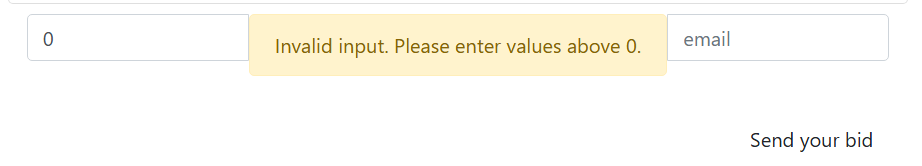

- When testing the bid price input field, I noticed that the error message would not hide when a new bid value was written, even after the submission.
- I managed to resolve this by resetting the error state. I used this snippet of code from [Medium](https://medium.com/@rbscoop2611/most-efficient-way-to-add-warning-messages-under-forms-input-field-472f2b70bb72):
  ```Python
          if (errors[name]) {
              setErrors(prevErrors => ({
                  ...prevErrors,
                  [name]: null
              }));
          }
  ```

**Hide Bid component for the seller**

- When working on the Bid component display, I decided to hide the bid form from the users who were selling the artwork. This way the sellers were only able to see the submitted bids and avoid bidding on their own artworks.
  - I used `!artwork.results[0]?.is_owner` in the ternary condition to render the bid form for the buyers only.

**Concatenating url link**


- when testing my deployed react website, I noticed that the url for creating an artwork listing was broken. Upon each click on the “create artwork”, “artwork” would be concatenated at the end
- I managed to resolve this by adding a missing / at the beginning of the link path in the NavBar.js file.

**no image upload error**


- When testing Artwork creation, I received the pictured error if no image was selected even though it was an optional field to submit.
  - I managed to resolve this by replacing the existing image related code in ArtworkCreateForm.js with this:
    ```jsx
    if (imageInput?.current?.files[0]) {
      formData.append("image", imageInput.current.files[0]);
    }
    ```

**Distorted NavBar view**

- when styling the navbar I noticed that in the mobile view on smaller screens the proportions of the screen got distorted. This was because of the Most selling profile componenet was set to show 4 profiles.
- I managed to resolve this problem by adding the below rules to the main App class in the App.js.
  - I have also reduced the number of profiles listed to 3, in order to prevent this error. However, I will be looking at implementing horizontal scrolling at the next development stage.
  ```css
  max-width: 100vw;
  overflow-x: hidden;
  ```

**Style and type filters returning non explicit data**

- I noticed that my style filter was returning entries for “other” for style and type of artwork.
  - I resolved this by replacing the "search=" with "style=" and "type=" in each useEffect for style and type. this seems to have resolved the issue.

**Artwork sold status not appearing straight away**

- Similarly, when testing my app, I noticed that the artwork was displaying sold status only after refreshing the page.
- I realised that I needed to update the artwork sold status in order to get the “Sold” statement appear upon clicking “Mark as sold” button.
  - I managed to get that working by altering the setBid code snippet to setArtwork snippet.
  - I found this part of React documentation useful: [React documentation - updating state](https://react.dev/reference/react/useState#updating-state-based-on-the-previous-state)

**Missing dependency in SignUpForm**

- When rendering the images for the carousel, I received `React Hook useEffect has a missing dependency: 'artwork Images'. Either include it or remove the dependency array react-hooks/exhaustive-deps` warning in devtools console.
  - This warning was irrelevant as using the dependency would have made the effect to rerender on each image, which was not needed.
    - I applied `// eslint-disable-next-line react-hooks/exhaustive-deps` to disable the warning, which I found in these two StackOverflow threads:
      - [how to fix missing dependency](https://stackoverflow.com/questions/55840294/how-to-fix-missing-dependency-warning-when-using-useeffect-react-hook)
      - [how to fix react hook useeffect has a missing dependency](https://stackoverflow.com/questions/64499336/how-to-fix-react-hook-useeffect-has-a-missing-dependency-either-include-it-or)
      - **to note:** es lint comment has been removed and a cleanup function added to address the memory leak error.

**Cancel button in username/password edit forms**

- When testing the change username and password forms, I noticed that when the user clicked on the cancel button, the following errors were thrown:
  
  
  - These errors seem to have appeared because I forgot to set the button element type to button.
    - After adding `type=button` to the button element for the cancel form functionality, the errors have resolved.

**Flickering pointer in Profile component**

- Flickering pointer over the toolpit in the Top sellers section was caused by overlapping Tooltip and css rules for the icons.
  - I managed to resolve this by setting hover effect to a different div element.

**Unmounted Image carousel component**


- The above error was showing up, when the user signs into their account.

  - To fix it, I added a cleanup function, using the code in the image as an example.

  

### Unfixed bugs

- When testing the website, I noticed that there is a discrepancy in the artwork edit once it is sold fuctionality.
  - It appears that once the atwork is marked as sold, if the seller chooses to edit the artwork, it is listed again as if it was not sold in the artwork list view. However, the user doesn't seem to be able to interact with it afresh, which does not cause any issues apart from misleading and confusing information displayed to the user.
  - I have circumvented this issue by disabling the edit functionality for the seller once the artwork is marked as sold.
    [Return to Table of Contents](#contents)
- The following errors noted in the console are expected to be present as per Moments walkthrough note, therefore I have not addressed these at this development stage:
  

### Lighthouse testing

Website performance, accessibility, best practices and SEO were tested using Lighthouse web performance testing tool. The tests were carried out using Google Chrome.

The scores have been marked down due to the use of external CDNs and Cloudinary storage.

<details>
<summary></summary>
</details>

[Return to Table of Contents](#contents)

### User stories testing

Below user stories testing

|                                                                                                                                          | Requirement met | Image                                                                                                                                                                                                                                                                                                                                                                                                                                                                                                                                                                                                                                                                                                                                                                                                                                                                                                                                                                              | Comments                                                             |
| ---------------------------------------------------------------------------------------------------------------------------------------- | --------------- | ---------------------------------------------------------------------------------------------------------------------------------------------------------------------------------------------------------------------------------------------------------------------------------------------------------------------------------------------------------------------------------------------------------------------------------------------------------------------------------------------------------------------------------------------------------------------------------------------------------------------------------------------------------------------------------------------------------------------------------------------------------------------------------------------------------------------------------------------------------------------------------------------------------------------------------------------------------------------------------- | -------------------------------------------------------------------- |
| As a First time user                                                                                                                     |                 |                                                                                                                                                                                                                                                                                                                                                                                                                                                                                                                                                                                                                                                                                                                                                                                                                                                                                                                                                                                    |                                                                      |
| As a first time user I can create an account so that I can sign in and access member's features.                                         | Yes             | 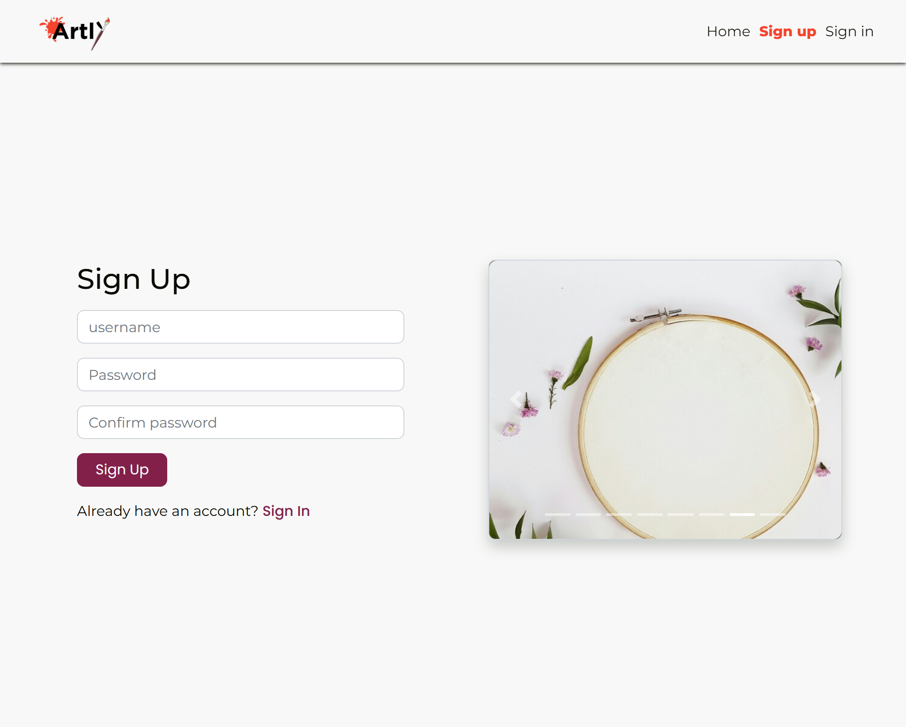                                                                                                                                                                                                                                                                                                                                                                                                                                                                                                                                                                                                                                                                                                                                                                                                                                                                                                                   |
| As a site user                                                                                                                           |                 |                                                                                                                                                                                                                                                                                                                                                                                                                                                                                                                                                                                                                                                                                                                                                                                                                                                                                                                                                                                    |                                                                      |
| As a site user I can login to & logout of the website so that I can access functionality for logged in users.                            | Yes             | 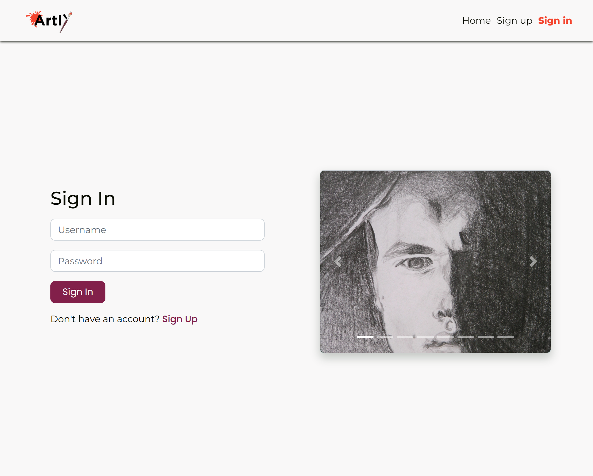                                                                                                                                                                                                                                                                                                                                                                                                                                                                                                                                                                                                                                                                                                                                                                                                                                                                                                                    |
| As a site user I can view the navbar from every page so that I can navigate easily between pages.                                        | Yes             |  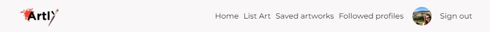                                                                                                                                                                                                                                                                                                                                                                                                                                                                                                                                                                                                                                                                                                                                                                                                                                               |
| As a site user I can see a list of posted artworks on the home page so that I can clearly see the latest posts that have been published. | Yes             |                                                                                                                                                                                                                                                                                                                                                                                                                                                                                                                                                                                                                                                                                                                                                                                                                                                                                                             |
| As a logged in user I can create my own artwork post so that I can share it with others and sell it.                                     | Yes             |                                                                                                                                                                                                                                                                                                                                                                                                                                                                                                                                                                                                                                                                                                                                                                                                                                                                                                              |
| As a site user I can edit the artwork post so that I can show the most up to date information.                                           | Yes             |                                                                                                                                                                                                                                                                                                                                                                                                                                                                                                                                                                                                                                                                                                                                                                                                                                |
| As a site user I can delete the artwork post so that it is no longer visible on the website for others to see.                           | Yes             |                                                                                                                                                                                                                                                                                                                                                                                                                                                                                                                                                                                                                                                                                                                                                                                                                                                                                                               |
| As a site user I can access a detailed artwork post so that I can read more about it.                                                    | Yes             |                                                                                                                                                                                                                                                                                                                                                                                                                                                                                                                                                                                                                                                                                                                                                                                                                                                                                                       |
| As a buyer I can make a bid the artwork so that I can buy it.                                                                            | Yes             | 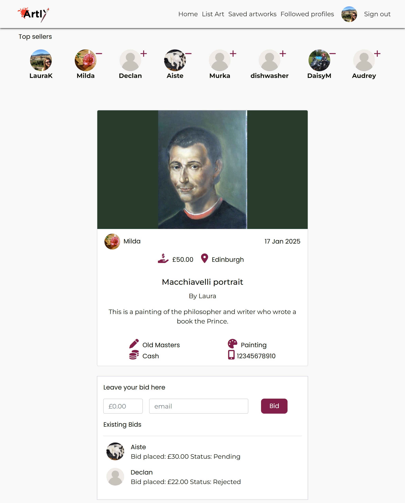                                                                                                                                                                                                                                                                                                                                                                                                                                                                                                                                                                                                                                                                                                                                                                                                                                                                                                                         |
| As a buyer I can delete my bid so that I can control removal of my bid for the artwork’s post.                                           | Yes             |                                                                                                                                                                                                                                                                                                                                                                                                                                                                                                                                                                                                                                                                                                                                                                                                                                                                                                                         |
| As a seller I can review pending bids so that I can decide which seller to sell the artwork to.                                          | Yes             | 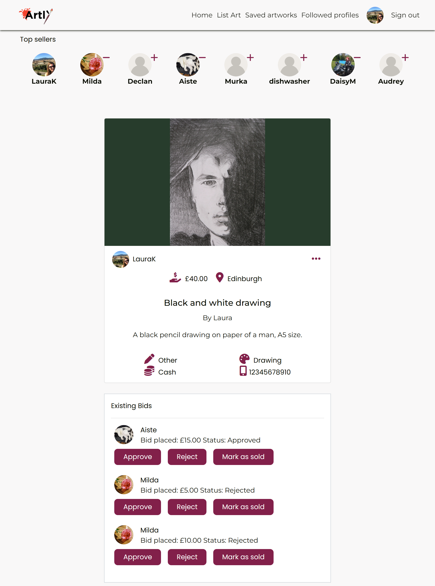                                                                                                                                                                                                                                                                                                                                                                                                                                                                                                                                                                                                                                                                                                                                                                                                                                                                                                    |
| As a seller I can set the artwork page as sold so that it is clear to the buyers the artwork is sold.                                    | Yes             |                                                                                                                                                                                                                                                                                                                                                                                                                                                                                                                                                                                                                                                                                                                                                                                                                                                                                                                     |
| As a seller I can get in touch with the buyer to organise the collection of the artwork.                                                 | Yes             |                                                                                                                                                                                                                                                                                                                                                                                                                                                                                                                                                                                                                                                                                                                                                                                                                                                                                                              | This feature will be further developed at the next development stage |
| As a logged in user I can update my profile so that I can keep it up-to-date with most relevant information.                             | Yes             | 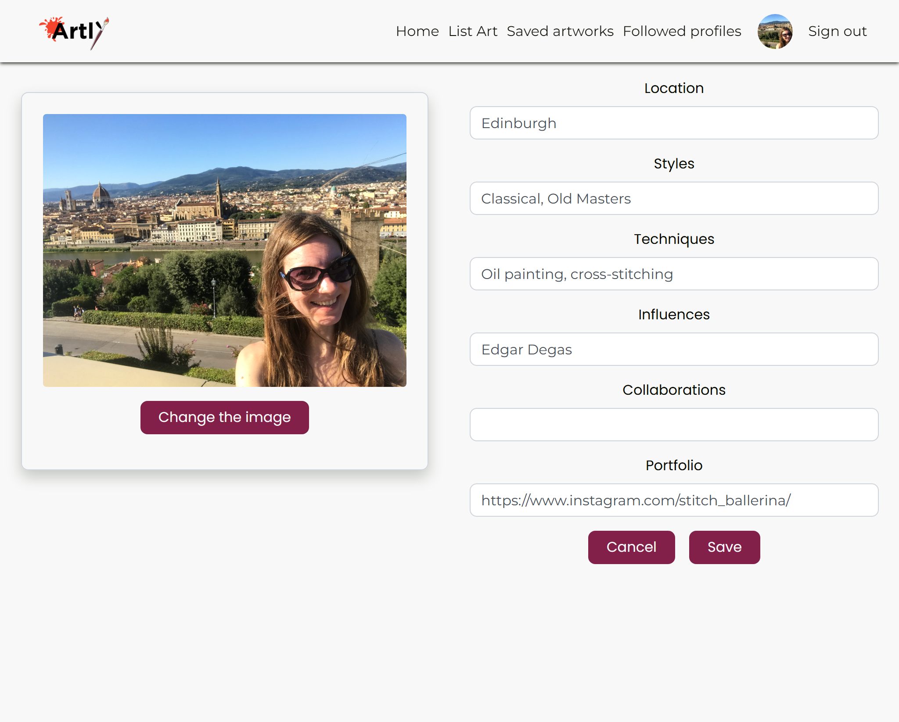                                                                                                                                                                                                                                                                                                                                                                                                                                                                                                                                                                                                                                                                                                                                                            |
| As a logged in user I can save the artwork post so that I can access them in one place.                                                  | Yes             |  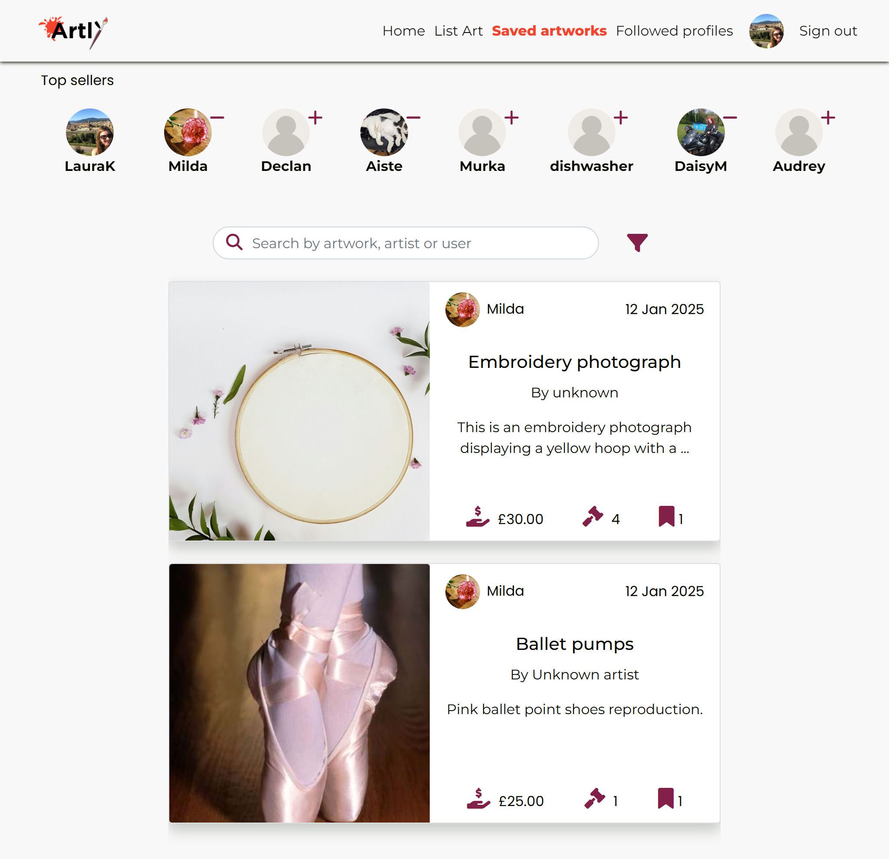                                                                                                                                                                                                                                                                                                                                                                                                                                                                                                                                                                                                                                                                                                                                                                                                                                      |
| As a site user I can search for artworks by keyword or filter by category/style so that I can find listings relevant to my interests.    | Yes             | 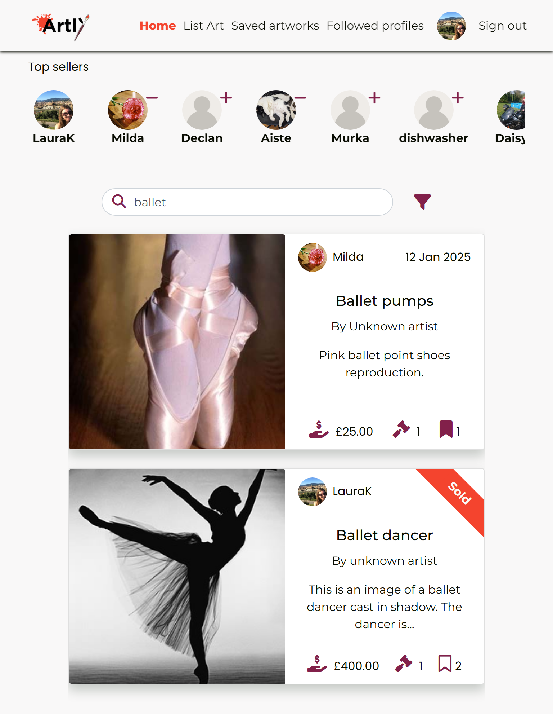                                                                                                                                                                                                                                                                                                                                                                                                                                                                                                                                                                                                                                                                                                                     |
| As a site user, I can see notification messages so that I know that my action was successful/completed.                                  | Yes             |    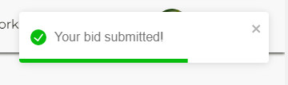 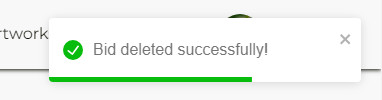    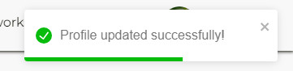    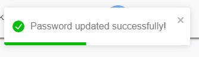 |
| As a site user I can see most selling users displayed on each page so that I can view their profiles.                                    | Yes             |                                                                                                                                                                                                                                                                                                                                                                                                                                                                                                                                                                                                                                                                                                                                                                                                                                                                                                                         |
| As a site user, I can follow or unfollow another user so that I can follow any updates from another user.                                | Yes             | 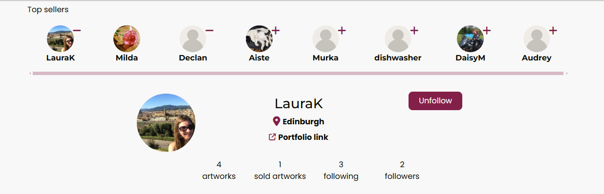                                                                                                                                                                                                                                                                                                                                                                                                                                                                                                                                                                                                                                                                                                                                                                                                                                           |
| As a site user I can submit a contact form to site admins so that I can report any issues with the website.                              | Future feature  |                                                                                                                                                                                                                                                                                                                                                                                                                                                                                                                                                                                                                                                                                                                                                                                                                                                                                                                                                                                    | This feature will be looked into at the next development stage       |
| As a site user, I can see the My bids tab so that I can access and see all of the bids I submitted.                                      | Future feature  |                                                                                                                                                                                                                                                                                                                                                                                                                                                                                                                                                                                                                                                                                                                                                                                                                                                                                                                                                                                    | This feature will be looked into at the next development stage       |

[Return to Table of Contents](#contents)

### Accessibility

The project was run through Wave evaluation tool and WCAG Colour contrast checker.

**Wave**

- Couple of errors were returned for the Sign up and Sign in pages, indicating lack of labels for input fields.
  - Lack of labels was a design choice, aiming for a clean design and indicating the purpose of each input field through the use of placeholder text.
- No other errors were detected when passing through Wave evaluation tool.

**WCAG**

- I ensured that sufficient color contrast is provided when choosing the color palette. I used [Contrast Grid tool](https://contrast-grid.eightshapes.com/) to ensure that the colors are well-chosen.
  - #F4442E color against the #F9F8F8 background did not pass through AA and AAA standards.
    - It was a design choice to use this colour as an accent color for hover effects, active classes in the Navigation bar and the sold ribbon.
- No other issues were noted.

  

[Return to Table of Contents](#contents)

### Device testing

The project was tested against the following devices and browsers:

- Google Chrome
- Google Chrome Dev
- Firefox
- Explorer
- Google Pixel 7
- Galaxy s10
- Galaxy Tab A
- iPhone 7
  - the website was working prior to adding the Procfile to the main root. There is a known bug with the setup on iOS for the separate frontend and backend versions of this project, and I will be looking at addressing this at the next development stage.
- iPhone 15
  - the website was working prior to adding the Procfile to the main root. There is a known bug with the setup on iOS for the separate frontend and backend versions of this project, and I will be looking at addressing this at the next development stage.

[Return to Table of Contents](#contents)

### User testing

The application was tested during the development and post-development stages. I have asked my friends and peers to notify me of any issues that might appear. No issues were reported/noted during the development and post-development aside from already mentioned bug in the device testing section.

[Return to Table of Contents](#contents)

### Manual testing

After the development stage of the application, I went through each feature, ensuring that the website is working as intended. Below is a table showing each user action and expected results.
**To note:** different error, validation messages are noted in the [features section](README.md#features).

| Page                                                     | User Actions                                            | Expected Results                                                                                                                                                                                                                                                                                                   | Y/N | Comments                                                                                                                                                                                                              |
| -------------------------------------------------------- | ------------------------------------------------------- | ------------------------------------------------------------------------------------------------------------------------------------------------------------------------------------------------------------------------------------------------------------------------------------------------------------------ | --- | --------------------------------------------------------------------------------------------------------------------------------------------------------------------------------------------------------------------- |
| General Navigation bar                                   |                                                         |                                                                                                                                                                                                                                                                                                                    |     |                                                                                                                                                                                                                       |
| 1                                                        | Click on the Logo "Artly"                               | Redirects to the artwork list view page                                                                                                                                                                                                                                                                            | Y   |                                                                                                                                                                                                                       |
| 2                                                        | Click on the Sign up                                    | Redirects to Sign Up page                                                                                                                                                                                                                                                                                          | Y   |                                                                                                                                                                                                                       |
| 3                                                        | Click on the Sign In                                    | Redirects to Sign In page                                                                                                                                                                                                                                                                                          | Y   |                                                                                                                                                                                                                       |
| Sign Up page                                             |                                                         |                                                                                                                                                                                                                                                                                                                    |     |                                                                                                                                                                                                                       |
| 1                                                        | Click on the Sign In button                             | Redirects to Sign In page                                                                                                                                                                                                                                                                                          | Y   |                                                                                                                                                                                                                       |
| 2                                                        | Enter valid username                                    | Will only accept one same username                                                                                                                                                                                                                                                                                 | Y   |                                                                                                                                                                                                                       |
| 3                                                        | Enter valid password                                    | Field will only accept password format                                                                                                                                                                                                                                                                             | Y   |                                                                                                                                                                                                                       |
| 4                                                        | Confirm password entry                                  | Field will only accept password format & the same password value as above                                                                                                                                                                                                                                          | Y   |                                                                                                                                                                                                                       |
| 5                                                        | Click on Sign Up button                                 | Redirects to Sign In page & a successful registration message appears "You are signed up! Please sing in."                                                                                                                                                                                                         | Y   |                                                                                                                                                                                                                       |
| 6                                                        | Click on carousel arrows                                | Flips through images quicker                                                                                                                                                                                                                                                                                       | Y   |                                                                                                                                                                                                                       |
| 7                                                        | Hover over the image                                    | Stops the carousel                                                                                                                                                                                                                                                                                                 | Y   |                                                                                                                                                                                                                       |
|                                                          |                                                         |                                                                                                                                                                                                                                                                                                                    |     |                                                                                                                                                                                                                       |
| Sign in page                                             |                                                         |                                                                                                                                                                                                                                                                                                                    |     |                                                                                                                                                                                                                       |
| 1                                                        | Click on Sign In button in the Navigation bar           | Redirects to Sign In page                                                                                                                                                                                                                                                                                          | Y   |                                                                                                                                                                                                                       |
| 2                                                        | Click on the Sign Up button in the form                 | Redirects to Sign Up page                                                                                                                                                                                                                                                                                          | Y   |                                                                                                                                                                                                                       |
| 3                                                        | Enter valid username                                    | Accepts existing username                                                                                                                                                                                                                                                                                          | Y   |                                                                                                                                                                                                                       |
| 4                                                        | Enter valid password                                    | Field only accepts password format                                                                                                                                                                                                                                                                                 | Y   |                                                                                                                                                                                                                       |
| 5                                                        | Click on Sign In button                                 | Redirects user to Home page and a login confirmation message appears "You are signed in!"                                                                                                                                                                                                                          | Y   |                                                                                                                                                                                                                       |
| 6                                                        | Click on Sign Out button                                | Redirects to the Home page and a logout confirmation message appears "You are logged out!"                                                                                                                                                                                                                         | Y   |                                                                                                                                                                                                                       |
| Home page (logged out user view)                         |                                                         |                                                                                                                                                                                                                                                                                                                    |     |                                                                                                                                                                                                                       |
| 1                                                        | Click on the artwork card                               | Redirects to the artwork detail view page                                                                                                                                                                                                                                                                          | Y   |                                                                                                                                                                                                                       |
| 2                                                        | Click on the profile avatar in the card                 | Redirects to that user's profile view page                                                                                                                                                                                                                                                                         | Y   |                                                                                                                                                                                                                       |
| 3                                                        | Click on the profile avatar within the Top sellers view | Redirects to that user's profile view page                                                                                                                                                                                                                                                                         | Y   |                                                                                                                                                                                                                       |
| 4                                                        | Hover over icons                                        | Toggle message appears indicating the meaning for each icon                                                                                                                                                                                                                                                        | Y   |                                                                                                                                                                                                                       |
| 5                                                        | Click on the bookmark icon                              | Message appears "Login to save the artwork"                                                                                                                                                                                                                                                                        | Y   |                                                                                                                                                                                                                       |
| 6                                                        | Scroll to the bottom of the page                        | Loads more artworks                                                                                                                                                                                                                                                                                                | Y   |                                                                                                                                                                                                                       |
| 7                                                        | Click on the funel icon                                 | Opens filter options for style, type, sold                                                                                                                                                                                                                                                                         | Y   |                                                                                                                                                                                                                       |
| 8                                                        | Click on any of the filter options                      | Opens a drop down list to choose from                                                                                                                                                                                                                                                                              | Y   |                                                                                                                                                                                                                       |
| 9                                                        | Click on any drop down list detail option               | Loads artwork list view based on the choice                                                                                                                                                                                                                                                                        | Y   |                                                                                                                                                                                                                       |
| 10                                                       | Click on any drop down list detail option               | If no categories have been set against the artwork, "No results found" image appears                                                                                                                                                                                                                               | Y   |                                                                                                                                                                                                                       |
| 11                                                       | Type artwork, user, artist name in the search field     | Loads artwork list view based on the choice                                                                                                                                                                                                                                                                        | Y   | If the user types in something that does not exist, "No results found" image appears                                                                                                                                  |
| smaller screens (tablets/mobiles)                        |                                                         |                                                                                                                                                                                                                                                                                                                    |     |                                                                                                                                                                                                                       |
| 12                                                       | scroll/drag scroll bar left/right                       | reveals all existing users in the top sellers section                                                                                                                                                                                                                                                              | Y   |                                                                                                                                                                                                                       |
| Registered user's Navigation bar                         |                                                         |                                                                                                                                                                                                                                                                                                                    |     |                                                                                                                                                                                                                       |
| 1                                                        | Click on the Logo "Stitch Art Guides"                   | Redirects to the home page                                                                                                                                                                                                                                                                                         | Y   |                                                                                                                                                                                                                       |
| 2                                                        | Click on the Home button                                | Redirects to the home page                                                                                                                                                                                                                                                                                         | Y   |                                                                                                                                                                                                                       |
| 3                                                        | Click on the List Art button                            | Redirects to Create Artwork fom page                                                                                                                                                                                                                                                                               | Y   |                                                                                                                                                                                                                       |
| 4                                                        | Click on the Saved button                               | Redirects to the artwork view that shows saved(bookmarked) artworks                                                                                                                                                                                                                                                | Y   |                                                                                                                                                                                                                       |
| 5                                                        | Click on the Followed profiles button                   | Redirects to the artwork view that shows artworks from the followed users                                                                                                                                                                                                                                          | Y   |                                                                                                                                                                                                                       |
| 6                                                        | Click on the Profile Avatar                             | Redirects to the logged in user's profile view page                                                                                                                                                                                                                                                                | Y   |                                                                                                                                                                                                                       |
| 7                                                        | Click on the Sign Out button                            | Redirects to the Home page and a logout confirmation message appears "You are logged out!"                                                                                                                                                                                                                         | Y   |                                                                                                                                                                                                                       |
| Home page (logged in user view)                          |                                                         |                                                                                                                                                                                                                                                                                                                    |     | All of the mentioned functionality as above plus additional features that are available only for logged in users                                                                                                      |
| 1                                                        | Click on the bookmark icon(other users')                | Changes the hollow icon to filled in icon and increases the bookmark count on the side                                                                                                                                                                                                                             | Y   |                                                                                                                                                                                                                       |
| 2                                                        | Click on the bookmark icon(logged in user's)            | If the artwork is the logged in user's, click is disabled and "You can't save your own artwork" message appears                                                                                                                                                                                                    | Y   |                                                                                                                                                                                                                       |
| Artwork detail page(logged out user)                     |                                                         |                                                                                                                                                                                                                                                                                                                    |     |                                                                                                                                                                                                                       |
| Artwork card feature                                     |                                                         |                                                                                                                                                                                                                                                                                                                    |     |                                                                                                                                                                                                                       |
| 1                                                        | Click on the profile avatar in the card                 | Redirects to that user's profile view page                                                                                                                                                                                                                                                                         | Y   |                                                                                                                                                                                                                       |
| 2                                                        | Hover over icons                                        | Toggle message appears indicating the meaning for each icon                                                                                                                                                                                                                                                        | Y   |                                                                                                                                                                                                                       |
| Existing Bids feature                                    |                                                         |                                                                                                                                                                                                                                                                                                                    |     |                                                                                                                                                                                                                       |
| 1                                                        | Click on the Sign up                                    | Redirects to Sign Up page                                                                                                                                                                                                                                                                                          | Y   |                                                                                                                                                                                                                       |
| 2                                                        | Click on the Sign In                                    | Redirects to Sign In page                                                                                                                                                                                                                                                                                          | Y   |                                                                                                                                                                                                                       |
| Artwork detail page(logged in user)                      |                                                         |                                                                                                                                                                                                                                                                                                                    |     | All of the mentioned functionality as above plus additional features that are available only for logged in users                                                                                                      |
| Artwork card feature for the artwork owners only         |                                                         |                                                                                                                                                                                                                                                                                                                    |     |                                                                                                                                                                                                                       |
| 1                                                        | Hover over the three dots icon                          | Colour changes to orange/red                                                                                                                                                                                                                                                                                       | Y   |                                                                                                                                                                                                                       |
| 2                                                        | Click on the three dots icon                            | Displays drop down list showing Edit or Delete options                                                                                                                                                                                                                                                             | Y   |                                                                                                                                                                                                                       |
| 3                                                        | Hover over Edit option                                  | Colour changes to orange/red                                                                                                                                                                                                                                                                                       | Y   |                                                                                                                                                                                                                       |
| 4                                                        | Click on the Edit option                                | Redirects to Artwork Edit form page                                                                                                                                                                                                                                                                                | Y   |                                                                                                                                                                                                                       |
| 5                                                        | Hover over Delete option                                | Colour changes to orange/red                                                                                                                                                                                                                                                                                       | Y   |                                                                                                                                                                                                                       |
| 6                                                        | Click on the Delete option                              | Deletes the artwork and "Artwork deleted successfully!" message appears                                                                                                                                                                                                                                            | Y   |                                                                                                                                                                                                                       |
| Existing Bids feature for the artwork owners             |                                                         |                                                                                                                                                                                                                                                                                                                    |     |                                                                                                                                                                                                                       |
| 1                                                        | Hover over Approve, Reject or Delete buttons            | Colour changes to orange/red                                                                                                                                                                                                                                                                                       | Y   |                                                                                                                                                                                                                       |
| 2                                                        | Click on Accept or Reject buttons                       | Bid's status changes accordingly                                                                                                                                                                                                                                                                                   | Y   |                                                                                                                                                                                                                       |
| 3                                                        | Click on Mark as sold button                            | Bid's status changes to Sold,  Accept/Reject/Mark as sold buttons hidden for all of the bids if there are more than one. "Email the buyer" button displays, "Sold" ribbon appears on the artwork card and artwork card three dots icon is hidden. If there are more than one bid, other bids' statuses are hidden. | Y   |                                                                                                                                                                                                                       |
| 4                                                        | Click on "Email the buyer" button                       | Prompts a mailto new window to open                                                                                                                                                                                                                                                                                | Y   |                                                                                                                                                                                                                       |
| Leave your bid here feature(for the buyers/bidders only) |                                                         |                                                                                                                                                                                                                                                                                                                    |     |                                                                                                                                                                                                                       |
| 1                                                        | Enter valid bid price                                   | Will only accept numerical values above 0                                                                                                                                                                                                                                                                          | Y   |                                                                                                                                                                                                                       |
| 2                                                        | Enter valid email                                       | Field will only accept email format                                                                                                                                                                                                                                                                                | Y   |                                                                                                                                                                                                                       |
| 3                                                        | Click on the Bid button                                 | "Your bid submitted!" messages displayed, the bid price and status appears in the Existing Bids section                                                                                                                                                                                                            | Y   | Bids count that is displayed in the Artwork list view on the home page increases by 1                                                                                                                                 |
| Existing Bids feature for the buyers/bidders             |                                                         |                                                                                                                                                                                                                                                                                                                    |     |                                                                                                                                                                                                                       |
| 1                                                        | Hover over the three dots icon                          | Colour changes to orange/red                                                                                                                                                                                                                                                                                       | Y   |                                                                                                                                                                                                                       |
| 2                                                        | Hover over Delete option                                | Colour changes to orange/red                                                                                                                                                                                                                                                                                       | Y   |                                                                                                                                                                                                                       |
| 3                                                        | Click on the Delete option                              | Deletes the artwork and "Bid deleted successfully!" message appears, bid instance removed from existing bids feature                                                                                                                                                                                               | Y   | A slight delay(1-2seconds) in registering bid delete command is noticeable. Bids count that is displayed in the Artwork list view on the home page decreases by 1.                                                    |
| List Art page                                            |                                                         |                                                                                                                                                                                                                                                                                                                    |     |                                                                                                                                                                                                                       |
| 1                                                        | Click on the image upload area                          | Opens a file uploader to choose an image from                                                                                                                                                                                                                                                                      | Y   | Only accepts correct size file upload                                                                                                                                                                                 |
| 2                                                        | Enter any of the fields                                 | Will accept any value.                                                                                                                                                                                                                                                                                             | Y   | Required fields will prompt an alert message to be displayed below each field.                                                                                                                                        |
| 3                                                        | Hover over the cancel button                            | Colour changes to orange/red                                                                                                                                                                                                                                                                                       | Y   |                                                                                                                                                                                                                       |
| 4                                                        | Click on the cancel button                              | Returns back to the previous page visited                                                                                                                                                                                                                                                                          | Y   |                                                                                                                                                                                                                       |
| 5                                                        | Hover over the create button                            | Colour changes to orange/red                                                                                                                                                                                                                                                                                       | Y   |                                                                                                                                                                                                                       |
| 6                                                        | Click on the Create button                              | "Artwork listing created successfully!" message displayed, redirects to the Artwork detail view page                                                                                                                                                                                                               | Y   |                                                                                                                                                                                                                       |
| Edit Artwork page                                        |                                                         |                                                                                                                                                                                                                                                                                                                    |     |                                                                                                                                                                                                                       |
| 1                                                        | Click on the image upload area                          | Opens a file uploader to choose an image from                                                                                                                                                                                                                                                                      | Y   |                                                                                                                                                                                                                       |
| 2                                                        | Enter any of the fields                                 | Will accept any value.                                                                                                                                                                                                                                                                                             | Y   |                                                                                                                                                                                                                       |
| 3                                                        | Hover over the cancel button                            | Colour changes to orange/red                                                                                                                                                                                                                                                                                       | Y   |                                                                                                                                                                                                                       |
| 4                                                        | Click on the cancel button                              | Returns back to the previous page visited                                                                                                                                                                                                                                                                          | Y   |                                                                                                                                                                                                                       |
| 5                                                        | Hover over the update button                            | Colour changes to orange/red                                                                                                                                                                                                                                                                                       | Y   |                                                                                                                                                                                                                       |
| 6                                                        | Click on the Update button                              | "Artwork updated successfully!" message displayed, redirects to the Artwork detail view page                                                                                                                                                                                                                       | Y   |                                                                                                                                                                                                                       |
| Saved pages(logged in users only)                        |                                                         |                                                                                                                                                                                                                                                                                                                    |     | Saved and followed profiles pages function the same way as the main Artwork list view (main page). However, the list of artworks displayed are either the ones the user saved or the artworks from the followed users |
| 1                                                        | Click on the artwork card                               | Redirects to the artwork detail view page                                                                                                                                                                                                                                                                          | Y   |                                                                                                                                                                                                                       |
| 2                                                        | Click on the profile avatar in the card                 | Redirects to that user's profile view page                                                                                                                                                                                                                                                                         | Y   |                                                                                                                                                                                                                       |
| 3                                                        | Click on the profile avatar within the Top sellers view | Redirects to that user's profile view page                                                                                                                                                                                                                                                                         | Y   |                                                                                                                                                                                                                       |
| 4                                                        | Hover over icons                                        | Toggle message appears indicating the meaning for each icon                                                                                                                                                                                                                                                        | Y   |                                                                                                                                                                                                                       |
| 5                                                        | Click on the bookmark icon                              | Changes the filled in follow icon to hollow  icon, decreases the the bookmark count on the side, removes the artwork from the list                                                                                                                                                                                 | Y   |                                                                                                                                                                                                                       |
| 6                                                        | Click on the funel icon                                 | Opens filter options for style, type, sold                                                                                                                                                                                                                                                                         | Y   |                                                                                                                                                                                                                       |
| 7                                                        | Click on any of the filter options                      | Opens a drop down list to choose from                                                                                                                                                                                                                                                                              | Y   |                                                                                                                                                                                                                       |
| 8                                                        | Click on any drop down list detail option               | Loads artwork list view based on the choice                                                                                                                                                                                                                                                                        | Y   |                                                                                                                                                                                                                       |
| 9                                                        | Click on any drop down list detail option               | If no categories have been set against the artwork, "No results found" image appears                                                                                                                                                                                                                               | Y   |                                                                                                                                                                                                                       |
| 10                                                       | Type artwork, user, artist name in the search field     | Loads artwork list view based on the choice                                                                                                                                                                                                                                                                        | Y   | If the user types in something that does not exist, "No results found" image appears                                                                                                                                  |
| smaller screens (tablets/mobiles)                        |                                                         |                                                                                                                                                                                                                                                                                                                    |     |                                                                                                                                                                                                                       |
| 12                                                       | scroll/drag scroll bar left/right                       | reveals all existing users in the top sellers section                                                                                                                                                                                                                                                              | Y   |                                                                                                                                                                                                                       |
| Followed profiles pages (logged in users only)           |                                                         |                                                                                                                                                                                                                                                                                                                    |     |                                                                                                                                                                                                                       |
| 1                                                        | Click on the artwork card                               | Redirects to the artwork detail view page                                                                                                                                                                                                                                                                          | Y   |                                                                                                                                                                                                                       |
| 2                                                        | Click on the profile avatar in the card                 | Redirects to that user's profile view page                                                                                                                                                                                                                                                                         | Y   |                                                                                                                                                                                                                       |
| 3                                                        | Click on the profile avatar within the Top sellers view | Redirects to that user's profile view page                                                                                                                                                                                                                                                                         | Y   |                                                                                                                                                                                                                       |
| 4                                                        | Hover over icons                                        | Toggle message appears indicating the meaning for each icon                                                                                                                                                                                                                                                        | Y   |                                                                                                                                                                                                                       |
| 5                                                        | Click on the bookmark icon                              | Changes the filled in follow icon to hollow icon(and vice versa), decreases/increases the the bookmark count on the side                                                                                                                                                                                           | Y   |                                                                                                                                                                                                                       |
| 6                                                        | Click on the funel icon                                 | Opens filter options for style, type, sold                                                                                                                                                                                                                                                                         | Y   |                                                                                                                                                                                                                       |
| 7                                                        | Click on any of the filter options                      | Opens a drop down list to choose from                                                                                                                                                                                                                                                                              | Y   |                                                                                                                                                                                                                       |
| 8                                                        | Click on any drop down list detail option               | Loads artwork list view based on the choice                                                                                                                                                                                                                                                                        | Y   |                                                                                                                                                                                                                       |
| 9                                                        | Click on any drop down list detail option               | If no categories have been set against the artwork, "No results found" image appears                                                                                                                                                                                                                               | Y   |                                                                                                                                                                                                                       |
| 10                                                       | Type artwork, user, artist name in the search field     | Loads artwork list view based on the choice                                                                                                                                                                                                                                                                        | Y   | If the user types in something that does not exist, "No results found" image appears                                                                                                                                  |
| smaller screens (tablets/mobiles)                        |                                                         |                                                                                                                                                                                                                                                                                                                    |     |                                                                                                                                                                                                                       |
| 11                                                       | scroll/drag scroll bar left/right                       | reveals all existing users in the top sellers section                                                                                                                                                                                                                                                              | Y   |                                                                                                                                                                                                                       |
| Profile view page (logged in user's profile page)        |                                                         |                                                                                                                                                                                                                                                                                                                    |     |                                                                                                                                                                                                                       |
| 1                                                        | Hover over the three dots icon                          | Colour changes to orange/red                                                                                                                                                                                                                                                                                       | Y   |                                                                                                                                                                                                                       |
| 2                                                        | Click on the three dots icon                            | Displays drop down list showing Edit profile, change username, change password options                                                                                                                                                                                                                             | Y   |                                                                                                                                                                                                                       |
| 3                                                        | Hover over Edit profile option                          | Colour changes to orange/red                                                                                                                                                                                                                                                                                       | Y   |                                                                                                                                                                                                                       |
| 4                                                        | Click on the Edit option                                | Redirects to Profile Edit form page                                                                                                                                                                                                                                                                                | Y   |                                                                                                                                                                                                                       |
| 5                                                        | Hover over change username option                       | Colour changes to orange/red                                                                                                                                                                                                                                                                                       | Y   |                                                                                                                                                                                                                       |
| 6                                                        | Click on the change username option                     | Redirects to change username form page                                                                                                                                                                                                                                                                             | Y   |                                                                                                                                                                                                                       |
| 7                                                        | Hover over change password option                       | Colour changes to orange/red                                                                                                                                                                                                                                                                                       | Y   |                                                                                                                                                                                                                       |
| 8                                                        | Click on the change password option                     | Redirects to change password form page                                                                                                                                                                                                                                                                             | Y   |                                                                                                                                                                                                                       |
| 9                                                        | Hover over Portfolio link                               | Colour changes to orange/red                                                                                                                                                                                                                                                                                       | Y   | This is only available if portfolio url is provided                                                                                                                                                                   |
| 10                                                       | Click on the Portfolio link                             | Redirects to the profided website page                                                                                                                                                                                                                                                                             | Y   | This is only available if portfolio url is provided                                                                                                                                                                   |
| 11                                                       | Click on the Artworks tab                               | Displays the user's artwork list view                                                                                                                                                                                                                                                                              | Y   |                                                                                                                                                                                                                       |
| 12                                                       | Click on the More Details tab                           | Displays user's syles, techniques, influences, collaborations detail information                                                                                                                                                                                                                                   | Y   |                                                                                                                                                                                                                       |
| Profile view page (Another user's profile page)          |                                                         |                                                                                                                                                                                                                                                                                                                    |     |                                                                                                                                                                                                                       |
| 1                                                        | Hover over the follow/unfollow button                   | Colour changes to orange/red                                                                                                                                                                                                                                                                                       | Y   |                                                                                                                                                                                                                       |
| 2                                                        | Click on the follow button                              | "you are now following {username}" message appears, changes the "followers" count below the username                                                                                                                                                                                                               | Y   |                                                                                                                                                                                                                       |
| 3                                                        | Click on the unfollow button                            | "you are no longer following {username}" message appears, changes the "followers" count below the username                                                                                                                                                                                                         | Y   |                                                                                                                                                                                                                       |
| 4                                                        | Hover over Portfolio link                               | Colour changes to orange/red                                                                                                                                                                                                                                                                                       | Y   | This is only available if portfolio url is provided                                                                                                                                                                   |
| 5                                                        | Click on the Portfolio link                             | Redirects to the profided website page                                                                                                                                                                                                                                                                             | Y   | This is only available if portfolio url is provided                                                                                                                                                                   |
| 6                                                        | Click on the Artworks tab                               | Displays the user's artwork list view                                                                                                                                                                                                                                                                              | Y   |                                                                                                                                                                                                                       |
| 7                                                        | Click on the More Details tab                           | Displays user's syles, techniques, influences, collaborations detail information                                                                                                                                                                                                                                   | Y   |                                                                                                                                                                                                                       |
| Edit Profile page view                                   |                                                         |                                                                                                                                                                                                                                                                                                                    |     |                                                                                                                                                                                                                       |
| 1                                                        | Click on change the image upload area                   | Opens a file uploader to choose an image from                                                                                                                                                                                                                                                                      | Y   |                                                                                                                                                                                                                       |
| 2                                                        | Enter information in any of the fields                  | Will accept any value.                                                                                                                                                                                                                                                                                             | Y   |                                                                                                                                                                                                                       |
| 3                                                        | Hover over the cancel button                            | Colour changes to orange/red                                                                                                                                                                                                                                                                                       | Y   |                                                                                                                                                                                                                       |
| 4                                                        | Click on the cancel button                              | Returns back to the previously visited page                                                                                                                                                                                                                                                                        | Y   |                                                                                                                                                                                                                       |
| 5                                                        | Hover over the save button                              | Colour changes to orange/red                                                                                                                                                                                                                                                                                       | Y   |                                                                                                                                                                                                                       |
| 6                                                        | Click on the save button                                | "Profile updated successfully!" message displayed, redirects to the Profile detail view page                                                                                                                                                                                                                       | Y   |                                                                                                                                                                                                                       |
| Edit username page view                                  |                                                         |                                                                                                                                                                                                                                                                                                                    |     |                                                                                                                                                                                                                       |
| 1                                                        | Enter new username value in the field                   | Will accept any value.                                                                                                                                                                                                                                                                                             | Y   |                                                                                                                                                                                                                       |
| 2                                                        | Hover over the cancel button                            | Colour changes to orange/red                                                                                                                                                                                                                                                                                       | Y   |                                                                                                                                                                                                                       |
| 3                                                        | Click on the cancel button                              | Returns back to the previously visited page                                                                                                                                                                                                                                                                        | Y   |                                                                                                                                                                                                                       |
| 4                                                        | Hover over the save button                              | Colour changes to orange/red                                                                                                                                                                                                                                                                                       | Y   |                                                                                                                                                                                                                       |
| 5                                                        | Click on the save button                                | "Username updated successfully!" message displayed, redirects to the Profile detail view page                                                                                                                                                                                                                      | Y   |                                                                                                                                                                                                                       |
| Edit password page view                                  |                                                         |                                                                                                                                                                                                                                                                                                                    |     |                                                                                                                                                                                                                       |
| 1                                                        | Enter new password                                      | Field will only accept password format                                                                                                                                                                                                                                                                             | Y   |                                                                                                                                                                                                                       |
| 2                                                        | Confirm password entry                                  | Field will only accept password format & the same password value as above                                                                                                                                                                                                                                          | Y   |                                                                                                                                                                                                                       |
| 3                                                        | Hover over the cancel button                            | Colour changes to orange/red                                                                                                                                                                                                                                                                                       | Y   |                                                                                                                                                                                                                       |
| 4                                                        | Click on the cancel button                              | Returns back to the previously visited page                                                                                                                                                                                                                                                                        | Y   |                                                                                                                                                                                                                       |
| 5                                                        | Hover over the save button                              | Colour changes to orange/red                                                                                                                                                                                                                                                                                       | Y   |                                                                                                                                                                                                                       |
| 6                                                        | Click on the save button                                | "Password updated successfully!" message displayed, redirects to the Profile detail view page                                                                                                                                                                                                                      | Y   |                                                                                                                                                                                                                       |

[Return to Table of Contents](#contents)

### Restricted access testing

I have implemented restricted access to specific content that is only allowed to the users who have a registered account.

| Page                       | User action                                                     | Expected Results                | Y/N | Comments                                                                                                                                                                                                         |
| -------------------------- | --------------------------------------------------------------- | ------------------------------- | --- | ---------------------------------------------------------------------------------------------------------------------------------------------------------------------------------------------------------------- |
| Create art page            | Type in the url address to create artwork form                  | Redirects to the main home page | Y   |                                                                                                                                                                                                                  |
| Edit artwork page          | Type in the url address for an individual artwork edit          | Redirects to the main home page | Y   |                                                                                                                                                                                                                  |
| Edit profile page          | Type in the url address for an individual profile edit          | Redirects to the main home page | Y   |                                                                                                                                                                                                                  |
| Edit profile username page | Type in the url address for an individual profile username edit | Redirects to the main home page | Y   |                                                                                                                                                                                                                  |
| Edit profile password page | Type in the url address for an individual profile password edit | Redirects to the main home page | Y   |                                                                                                                                                                                                                  |
| Saved & Followed pages     | Type in the url address for the /saved or /followed             | Redirects to the main home page | Y   | The website redirects not logged in users to the home page, however, the url keeps `/saved` or `/followed` snippets attached. Apart from being misleading, this does not affect the functionality of the website |

[Return to Table of Contents](#contents)

### Automated Testing

- Automated testing has been implemented for the following:

[Return to Table of Contents](#contents)

[Return to the main README.md](README.md)
